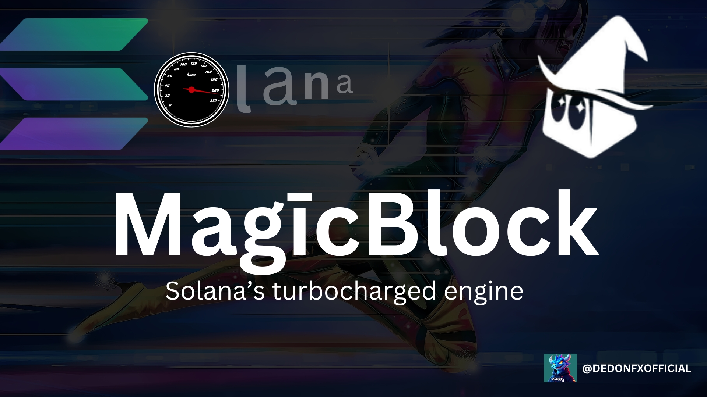
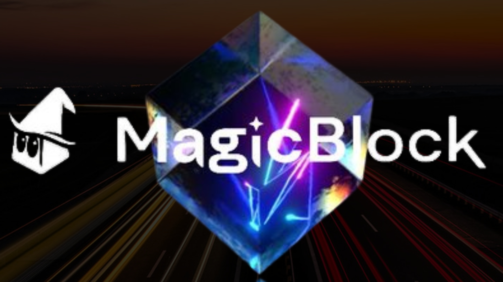
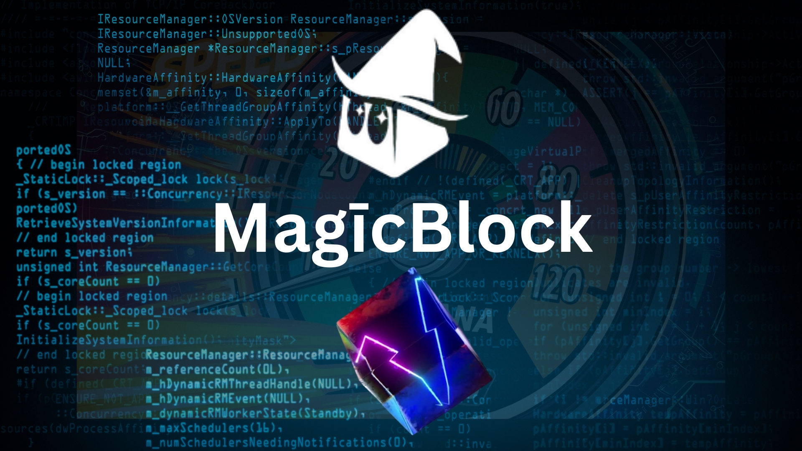

# Flash vs. MagicBlock – The Ultimate Solana Race 🏎️⚡  

  

Imagine **Flash** lining up on the Solana racetrack, ready to flex his speed. He smirks, saying:  

> **"I am speed."**  

Then **MagicBlock** pulls up, grinning:  

> **"Hold my beer."** 🍺  

The light turns green. Who wins? Let's find out. 🏁  

---  

## 🚀 What is MagicBlock?  
  

MagicBlock is **Solana’s turbocharged engine** for real-time decentralized apps & games.  

It introduces **Ephemeral Rollups**, enabling:  
✅ **Ultra-low latency** (sub-second speed)  
✅ **Gasless transactions**  
✅ **Custom runtimes**  
✅ **Dynamic scalability**  

**Flash is fast. But is he MagicBlock-fast?**  

---  

## ⚡ The Secret Weapon: Ephemeral Rollups  
  

Unlike L2s that create separate roads, **MagicBlock keeps the race on Solana’s main track** by:  
✅ Processing transactions **off-chain** at high speed  
✅ Committing the final state **back to Solana**  
✅ Keeping **full composability** intact  

Flash is good. But **MagicBlock? No pit stops. No detours. Just speed.**  

---  

## 🛠️ For Developers: Build Faster, Scale Smarter  
  

Integrating MagicBlock is like **upgrading your engine mid-race**:  
1️⃣ Write your program in **Rust, Anchor, or Bolt**  
2️⃣ Add **delegation hooks**  
3️⃣ Deploy on **Solana**  
4️⃣ Connect your frontend via **Solana SDKs**  

---  

## 🏎️ Delegation & Undelegation: The Pit Stops  
  

🏎️ **Delegation:** Transfer accounts to MagicBlock for turbocharged processing.  
🏁 **Undelegation:** Return accounts to Solana with finalized state.  

All controlled using `ephemeral_rollups_sdk`. **Your code, your rules.**  

---  

## 🏎️ Real-Life Speed Test  
  

A game where **players move every 100ms** would lag on most blockchains.  

With **MagicBlock, positions update instantly**, creating **seamless real-time multiplayer** on-chain. **Flash can run, but MagicBlock doesn’t even break a sweat.** 🎮⚡  

---  

## 🔗 Beyond Gaming: DeFi & NFTs Get a Boost  
  

MagicBlock isn’t just for gaming. It enables:  
💹 **DEXs & prediction markets** – no waiting for transactions.  
🎭 **NFT minting** – no more failed mints due to congestion.  
🛍️ **On-chain commerce** – seamless & instant transactions.  

**Flash is fast, but MagicBlock is unstoppable.**  

---  

## 🔒 Security & Trust  
  

MagicBlock combines **optimistic execution** for speed with **ZK verification** for trust.  

Think of it as **F1 pit stops**—lightning-fast adjustments, but **every move is double-checked before hitting the track again.** 🏎️  

---  

## 🏁 Flash’s Final Lap  
  

Most blockchains trade **speed for composability**. MagicBlock says:  

> **"Why not both?"**  

✅ No fragmented state  
✅ No isolated app chains  
✅ No trade-offs  

Flash finishes the race, **breathless.** MagicBlock? **Already chilling at the finish line.** 😎  

---  

## 🔥 My Deep Dive into MagicBlock  
I took a deep dive into **MagicBlock’s game-changing speed on Solana.**  

🔗 **Check out my tweet here:** [View on X](https://x.com/DEDONFXOFFICIAL/status/1901481131502964916?t=VHfbZx5DHaaKYLEG6ASAbA&s=19)  

🚀 **Build now → [magicblock.gg](https://www.magicblock.gg)**
