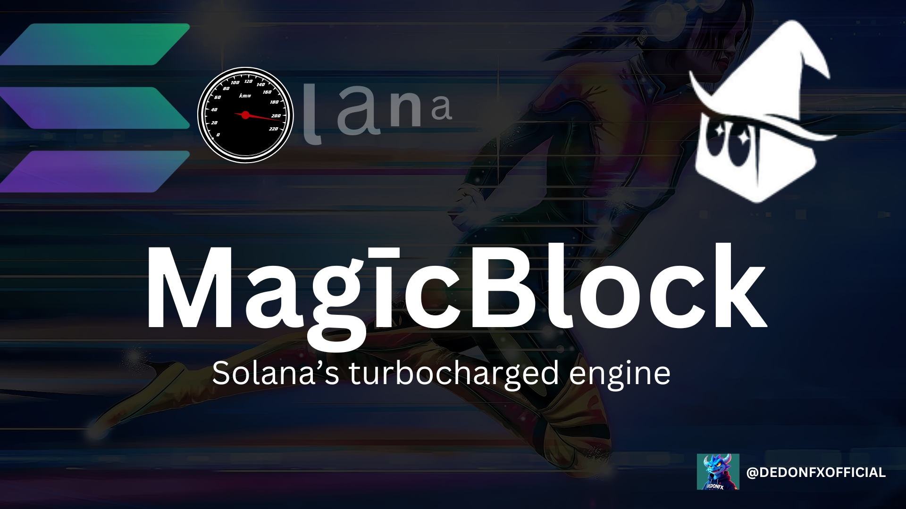
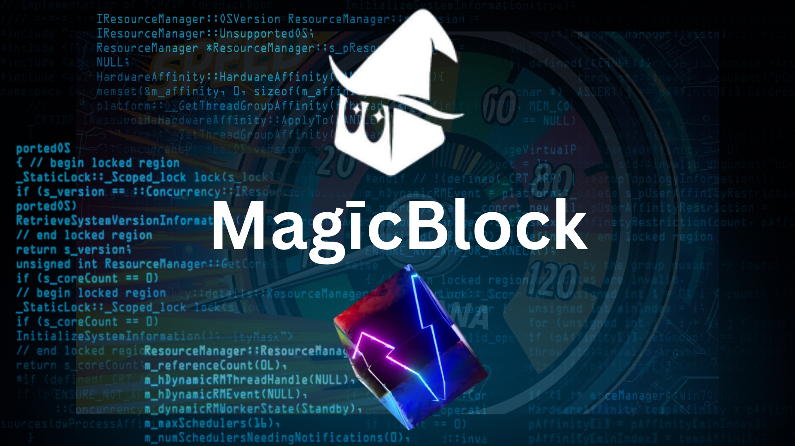

Flash vs. MagicBlock – The Ultimate Solana Race 🏎️⚡

Imagine Flash lining up on the Solana racetrack, ready to flex his speed. He smirks, saying:

> "I am speed."

Then MagicBlock pulls up, grinning:

> "Hold my beer." 🍺

The light turns green. Who wins? Let's find out. 🏁

🚀 What is MagicBlock?

MagicBlock is Solana’s turbocharged engine for real-time decentralized apps & games.

It introduces Ephemeral Rollups, enabling:

Ultra-low latency (sub-second speed)

Gasless transactions

Custom runtimes

Dynamic scalability

Flash is fast. But is he MagicBlock-fast?

⚡ The Secret Weapon: Ephemeral Rollups

Unlike L2s that create separate roads, MagicBlock keeps the race on Solana’s main track by:
✅ Processing transactions off-chain at high speed
✅ Committing the final state back to Solana
✅ Keeping full composability intact

Flash is good. But MagicBlock? No pit stops. No detours. Just speed.

🛠️ For Developers: Build Faster, Scale Smarter

Integrating MagicBlock is like upgrading your engine mid-race:
1️⃣ Write your program in Rust, Anchor, or Bolt
2️⃣ Add delegation hooks
3️⃣ Deploy on Solana
4️⃣ Connect your frontend via Solana SDKs

Delegation & Undelegation: The Pit Stops

🏎️ Delegation: Transfer accounts to MagicBlock for turbocharged processing.

🏁Undelegation: Return accounts to Solana with finalized state.

All controlled using ephemeral_rollups_sdk. Your code, your rules.

🏎️ Real-Life Speed Test

A game where players move every 100ms would lag on most blockchains.

With MagicBlock, positions update instantly, creating seamless real-time multiplayer on-chain. Flash can run, but MagicBlock doesn’t even break a sweat. 🎮⚡

🔗 Beyond Gaming: DeFi & NFTs Get a Boost

MagicBlock isn’t just for gaming. It enables:
💹 DEXs & prediction markets – no waiting for transactions.
🎭 NFT minting – no more failed mints due to congestion.
🛍️ On-chain commerce – seamless & instant transactions.

Flash is fast, but MagicBlock is unstoppable.

🔒 Security & Trust

MagicBlock combines optimistic execution for speed with ZK verification for trust.

Think of it as F1 pit stops—lightning-fast adjustments, but every move is double-checked before hitting the track again. 🏎️

🏁 Flash’s Final Lap

Most blockchains trade speed for composability. MagicBlock says:

> "Why not both?"

✅ No fragmented state
✅ No isolated app chains
✅ No trade-offs

Flash finishes the race, breathless. MagicBlock is already chilling at the finish line.😎

I took a deep dive into MagicBlock’s game-changing speed on Solana.

🔗 Check out my tweet here: https://x.com/DEDONFXOFFICIAL/status/1901481131502964916?t=VHfbZx5DHaaKYLEG6ASAbA&s=19

🚀 Build now → magicblock.
